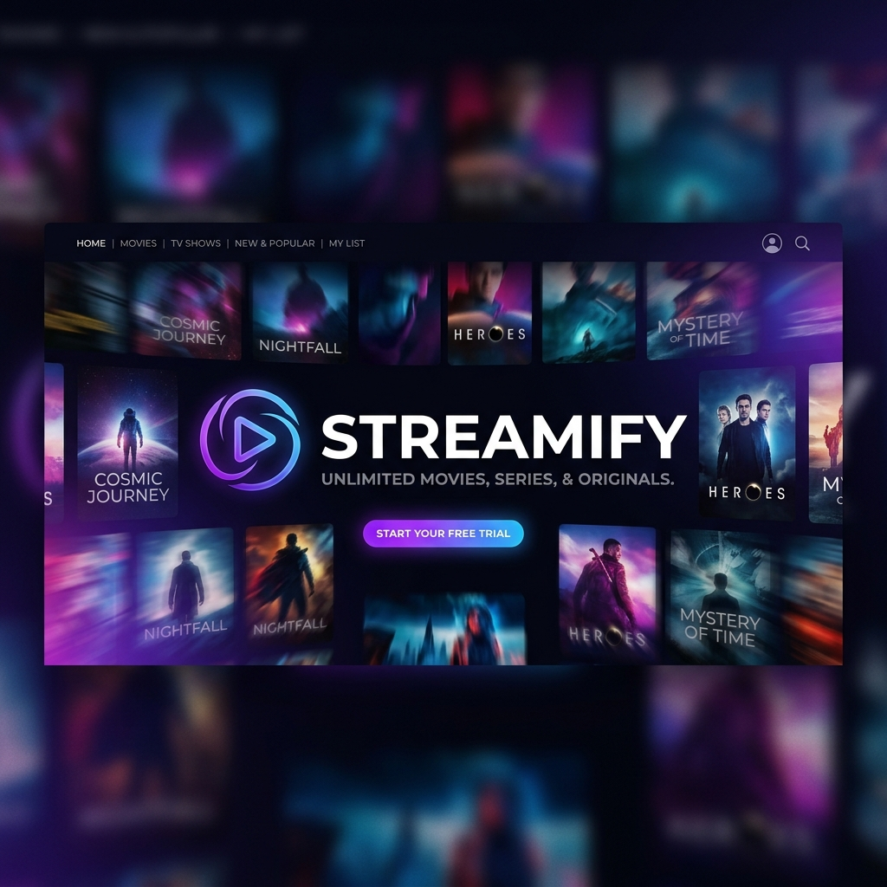
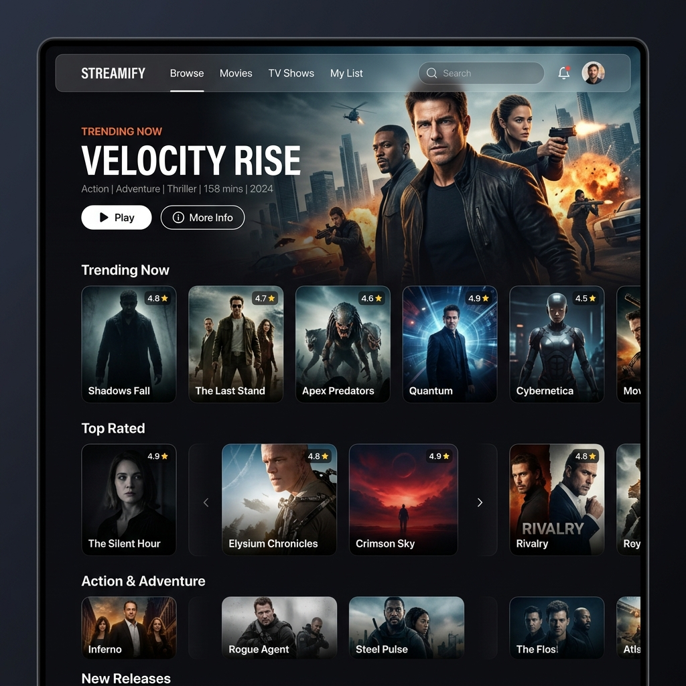
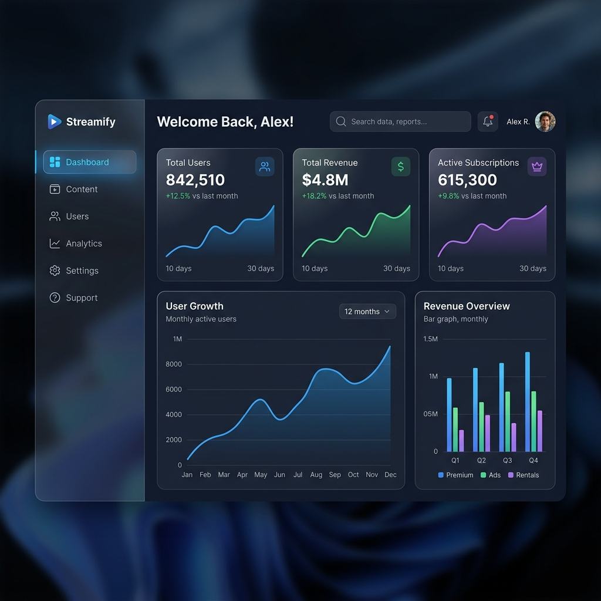

# <align align="center">🎬 Streamify</align>

<p align="center">
  
</p>

<p align="center">
  <b>Experience Entertainment Like Never Before</b><br>
  <i>A premium, feature-rich video streaming platform built with PHP and MySQL.</i>
</p>

<p align="center">
  
  
  
  
  
  
</p>

---

## 🌟 Overview

**Streamify** is a high-performance video streaming web application designed to deliver a seamless, Netflix-like experience. From high-quality playback to advanced content management, Streamify is engineered for both users who love content and admins who want to manage it effortlessly.

---

## 🚀 Key Features

### 📺 For the Viewers
- **Cinematic Experience**: A sleek, dark-themed UI that puts content first.
- **Progress Tracking**: "Continue Watching" feature to pick up right where you left off.
- **Smart Reminders**: Never miss an episode with the "Remind Me" notification system.
- **Premium Subscription**: Tiered access to exclusive movies and shows.
- **Interactive Player**: Modern video playback with [Plyr.io](https://plyr.io/) integration.
- **Personalized Watchlist**: Save your favorites for a rainy day.
- **Global Search**: Find movies, TV shows, or genres in a heartbeat.

### 🛠️ For the Administrators
- **Power Dashboard**: Real-time visualization of user growth and revenue trends using **Chart.js**.
- **Content Studio**: A robust interface to add, update, and manage the entire library.
- **User Insights**: Detailed analytics on user behavior and subscription statuses.
- **Financial Tracking**: Monitor earnings across Monthly, Quarterly, and Yearly plans.
- **Feedback Loop**: Direct access to user ratings and content feedback.

---

## 🎨 Visual Showcase

| 🏠 Home Page Experience | 📊 Professional Admin Dashboard |
| :---: | :---: |
|  |  |

---

## 🛠️ Tech Stack

<div align="center">

| Core | Frontend | Libraries |
| :--- | :--- | :--- |
| **PHP 8.x** (Backend) | **Bootstrap 5** (Layout) | **Chart.js** (Analytics) |
| **MySQL** (Database) | **Vanilla CSS3** (Styling) | **Swiper.js** (Carousels) |
| **jQuery** (AJAX) | **FontAwesome 6** (Icons) | **Plyr.io** (Video Player) |

</div>

---

## ⚙️ Installation Guide

### Prerequisites
- PHP >= 7.4
- MySQL
- Apache Server (XAMPP / WAMP / Laragon)

### Setup Steps

1. **Clone the Galaxy**:
   ```bash
   git clone https://github.com/Mallesham21/Streamify.git
   ```

2. **Database Configuration**:
   - Create a database named `Streamify` in your MySQL server.
   - Import `Streamify.sql` from the root directory.
   - Update `db.php` and `Admin/config/database.php` with your credentials:
     ```php
     $host = 'localhost';
     $dbname = 'Streamify';
     $username = 'your_username';
     $password = 'your_password';
     ```

3. **Launch**:
   - Move the project to your server's root (`htdocs`).
   - Open your browser and navigate to `http://localhost/Streamify`.

---

## 🗺️ Roadmap

- [ ] **Mobile App**: Cross-platform Flutter app for on-the-go streaming.
- [ ] **AI Recommendations**: Personalized content suggestions based on viewing history.
- [ ] **Live TV**: Integration for real-time broadcast streaming.
- [ ] **Multi-language Support**: Reach a global audience with localized UI.

---

## 🤝 Contributing

We love contributions! If you have ideas to make Streamify even better:
1. Fork the Project
2. Create your Feature Branch (`git checkout -b feature/AmazingFeature`)
3. Commit your Changes (`git commit -m 'Add some AmazingFeature'`)
4. Push to the Branch (`git push origin feature/AmazingFeature`)
5. Open a Pull Request

---


<p align="center">
  Built with 💜 by <a href="https://github.com/Mallesham21">Mallesham</a>
</p>
